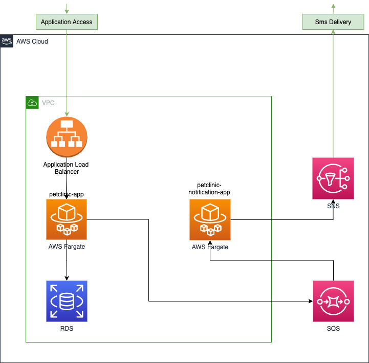

# Thundra Sidekick PetClinic Sample Application

We prepared a demo application and scenario based on a “Petclinic” application. We added a new notification application
to the existing monolithic Petclinic application to turn the application into a microservice architecture. Therefore,
our application is composed of two Spring applications running on AWS Fargate and communicating asynchronously via
Amazon SQS. The Petclinic application receives the request from Application Load Balancer and informs the
Petclinic-Notification application via a message through SQS. Then, the Petclinic-Notification application notifies the
user with an SMS by using the Amazon SNS service. See the below diagram for the application architecture:



## Running app

Before running the application, <YOUR_THUNDRA_API_KEY> keys must be replaced with your own keys.You can get the required
api key from [Thundra Sidekick](https://sidekick.thundra.io/signup).

## Running app locally

This app is a Spring Boot application built using Maven. We create docker-compose file for running all component
together. Therefore, docker and docker-compose must be installed in the local environment.

### Run App

```
git clone https://github.com/thundra-io/thundra-sidekick-petclinic-demo.git
cd thundra-sidekick-petclinic-demo
docker-compose up --build --detach
```

### Stop App

```
docker-compose down --volumes
```

## Running app on AWS

We create AWS CDK app for deployment on AWS environment. Deployment app is a NodeJS application. Therefore, NodeJS, npm,
typescript and aws-cdk must be installed in the local environment.

### Deploy app on AWS

```
git clone https://github.com/thundra-io/thundra-sidekick-petclinic-demo.git
cd thundra-sidekick-petclinic-demo/deployment
./deploy.sh
```

### Destroy app on AWS

The following command can be called

```
./destroy.sh
```

or remove cloudformation template on AWS Console.
